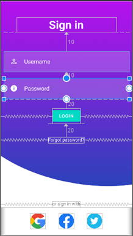

<p align = "center">МИНИСТЕРСТВО НАУКИ И ВЫСШЕГО ОБРАЗОВАНИЯ<br>
РОССИЙСКОЙ ФЕДЕРАЦИИ<br>
ФЕДЕРАЛЬНОЕ ГОСУДАРСТВЕННОЕ БЮДЖЕТНОЕ<br>
ОБРАЗОВАТЕЛЬНОЕ УЧРЕЖДЕНИЕ ВЫСШЕГО ОБРАЗОВАНИЯ<br>
«САХАЛИНСКИЙ ГОСУДАРСТВЕННЫЙ УНИВЕРСИТЕТ»</p>
<br><br><br><br><br><br>
<p align = "center">Институт естественных наук и техносферной безопасности<br>Кафедра информатики<br>Григораш Алексей Владимирович</p>
<br><br><br>
<p align = "center">Лабораторная работа № 7<br>«<strong>Макет</strong>»<br>01.03.02 Прикладная математика и информатика</p>
<br><br><br><br><br><br><br><br><br><br><br><br>
<p align = "right">Научный руководитель<br>
Соболев Евгений Игоревич</p>
<br><br><br>
<p align = "center">г. Южно-Сахалинск<br>2023 г.</p>
<br><br><br><br><br><br><br><br>

## Введение:
**Android Studio** — интегрированная среда разработки производства Google, с помощью которой разработчикам становятся доступны инструменты для создания приложений на платформе Android OS


## Задачи:
**Упражнение. Сделать функциональный макет**

Необходимо реализовать макет по изображению использую материалы из архива lab7.zip, соблюдая отступы согласно рисунку 1. 
<div align="center">
    
    <p>Рисунок 1 – Прототип макета</p>
    
    <p>Рисунок 2 – Финальный макет</p>
</div>
Реализовать простую авторизацию по логину и паролю, при удачной попытке вывести пользователю сообщение об авторизации, если пароль логин неверный, то сообщение об ошибке. 

## Решение:

### Username: alexey

### Password: alexey1 

<div align="center">
    
</div>

### MainActivity.kt:

```kt

package com.example.applab7

import androidx.appcompat.app.AppCompatActivity
import android.os.Bundle
import android.widget.Button
import android.widget.EditText
import android.widget.TextView
import android.widget.Toast

class MainActivity : AppCompatActivity() {

    private lateinit var loginButton: Button
    private lateinit var usernameTextEdit: EditText
    private lateinit var passwordTextEdit: EditText
    private lateinit var forgotPasswordTextView: TextView
    
    override fun onCreate(savedInstanceState: Bundle?) {
        super.onCreate(savedInstanceState)
        setContentView(R.layout.activity_main)

        loginButton = findViewById(R.id.login_button)
        usernameTextEdit = findViewById(R.id.username_text)
        passwordTextEdit = findViewById(R.id.password_text)
        forgotPasswordTextView = findViewById(R.id.forgot_password_text)

        forgotPasswordTextView.setOnClickListener {
            Toast.makeText(this, "\"alexey\" + 1", Toast.LENGTH_SHORT).show()
        }

        loginButton.setOnClickListener {
            val text = if (usernameTextEdit.text.toString().isEmpty()) "Enter username"
                else if (passwordTextEdit.text.toString().isEmpty()) "Enter password"
                else if (usernameTextEdit.text.toString() == "alexey" && passwordTextEdit.text.toString() == "alexey1") "Logged in"
                else "Wrong username or password"

            Toast.makeText(this, text, Toast.LENGTH_SHORT).show()
        }

    }
}

```

## Вывод:
В ходе выполнения задач реализовал макет и простую авторизацию по логину и паролю